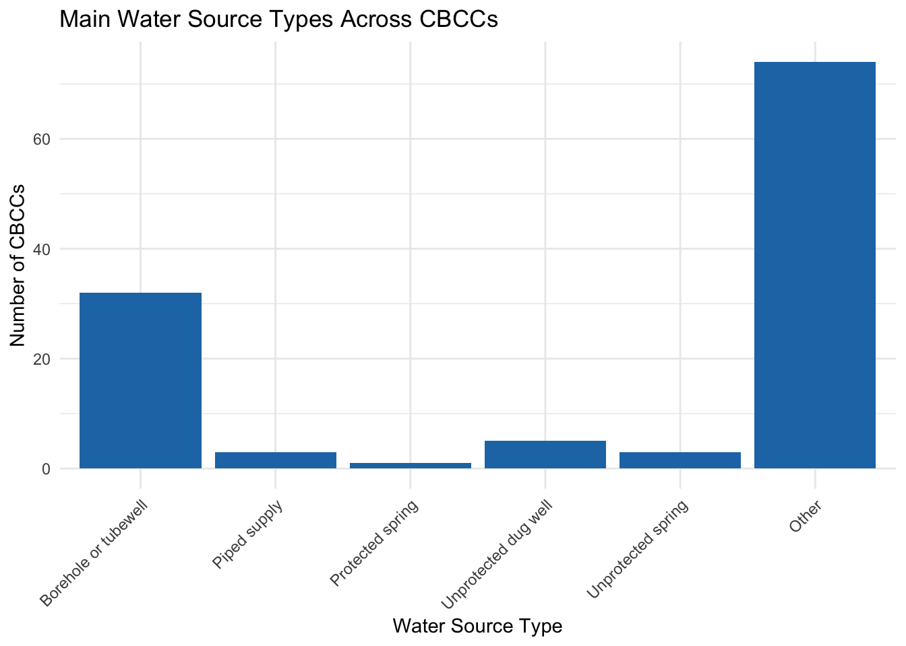
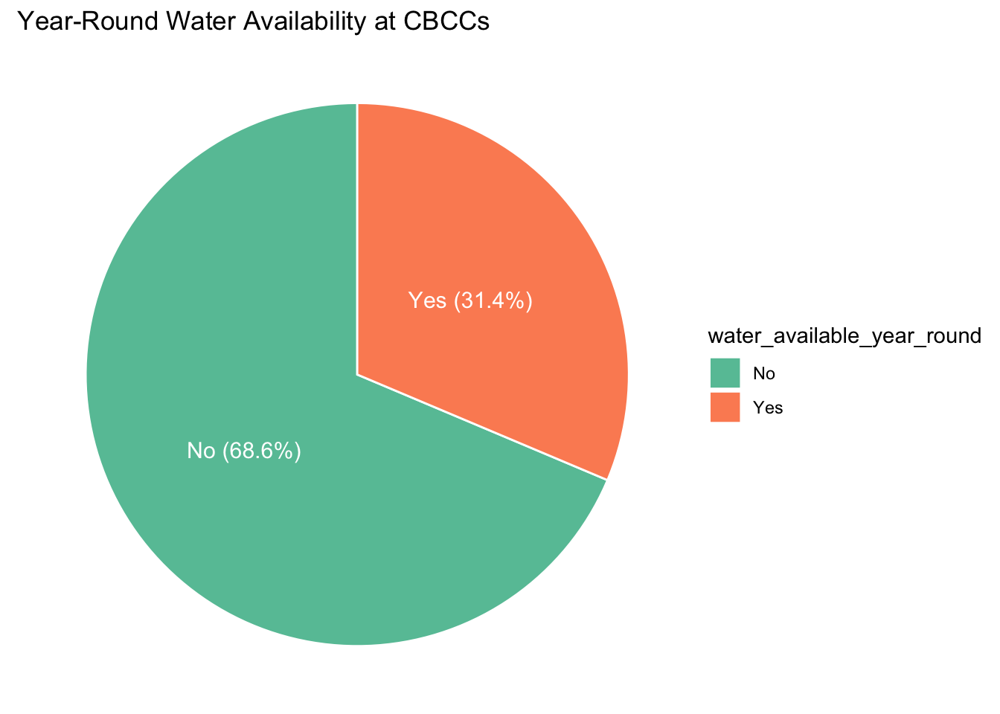

# WASH and Sanitation Survey in Community-Based Childcare Centres – Thyolo and Chikwawa, Malawi (2021)

[](https://doi.org/10.5281/zenodo.17540498)

[](https://zenodo.org/doi/10.5281/zenodo.17540498)
[](https://github.com/openwashdata/thyolocbcc/actions/workflows/R-CMD-check.yaml)

This dataset provides detailed information on Water, Sanitation, and
Hygiene (WASH) conditions and related management practices in
Community-Based Childcare Centres (CBCCs) across Thyolo and Chikwawa
Districts in Malawi, collected in 2021. Data were gathered by BASEflow
using the mWater digital data collection platform.

The dataset contains metadata about the survey, including the
geographical location of CBCCs, water sources and their functionality,
sanitation infrastructure, hygiene practices, governance and management
structures, funding mechanisms, cleanliness levels, and the availability
of hygiene education and promotional materials.

Intended Users and Applications

1.  Local Government and Health Authorities: To monitor WASH conditions,
    inform resource allocation, and design targeted interventions within
    Thyolo’s CBCCs.

2.  CBCC Management and Caregivers: To identify gaps and improve
    maintenance, hygiene practices, and infrastructure.

3.  NGOs and Development Partners: To support planning, implementation,
    and evaluation of WASH programs aligned with community needs and WHO
    standards.

4.  Researchers and Policy Makers: To study the relationship between
    WASH facilities and child health outcomes for evidence-based
    decision-making.

5.  Donors and Funders: To assess infrastructure needs and measure
    impact of funded WASH initiatives.

## Installation

You can install the development version of thyolocbcc from
[GitHub](https://github.com/) with:

``` r

# install.packages("devtools")
devtools::install_github("openwashdata/thyolocbcc")
```

``` r

## Run the following code in console if you don't have the packages
## install.packages(c("dplyr", "knitr", "readr", "stringr", "gt", "kableExtra"))
library(dplyr)
library(knitr)
library(readr)
library(stringr)
library(gt)
library(kableExtra)
```

Alternatively, you can download the individual datasets as a CSV or XLSX
file from the table below.

1.  Click Download CSV. A window opens that displays the CSV in your
    browser.
2.  Right-click anywhere inside the window and select “Save Page As…”.
3.  Save the file in a folder of your choice.

| dataset | CSV | XLSX |
|:---|:---|:---|
| thyolocbcc | [Download CSV](https://github.com/openwashdata/thyolocbcc/raw/main/inst/extdata/thyolocbcc.csv) | [Download XLSX](https://github.com/openwashdata/thyolocbcc/raw/main/inst/extdata/thyolocbcc.xlsx) |

## Data

The package provides access to Community-Based Childcare Centres (CBCCs)
in Thyolo District, focusing on critical Water, Sanitation, and Hygiene
(WASH) infrastructure and practices

``` r

library(thyolocbcc)
```

### thyolocbcc

The dataset `thyolocbcc` contains 118 observations and 98 variables

``` r

thyolocbcc |> 
  head(3) |> 
  gt::gt() |>
  gt::as_raw_html()
```

| submitted_on | district | enrollment_male_total | enrollment_female_total | enrollment_male_disability | enrollment_female_disability | latitude | longitude | photo_cbcc | cbcc_has_water | main_water_source | water_source_available_now | water_source_functional_status | breakdown_cause | breakdown_past_12_months | breakdown_fixed_date | distance_water_market_magnitude | distance_water_market_unit | water_available_year_round | alternative_water_source | water_supply_satisfaction | why_not_satisfied_water | complaint_about_water | alt_water_available_now | distance_alt_water_magnitude | distance_alt_water_unit | main_water_50m_from_contaminants | water_treatment_method | water_treatment_method_other | treatment_meets_who_standards | last_microbacteria_test_date | microbacteria_test_result_fcu | water_quality_meets_who | water_mgmt_committee_available | committee_trained_on_maintenance | committee_functional | committee_functional_comments | operation_funds_available | funds_amount_account | funds_source | other_source_of_funds | financial_records_kept | has_wash_plan_budget | additional_comments_1 | usable_toilets_for_kids | girls_toilet_total | boys_toilet_total | usable_toilets_for_staff | male_staff_toilet_total | female_staff_toilet_total | toilet_for_physically_challenged | toilet_for_adolescent_girls | toilets_visibly_clean | toilet_cleaning_frequency | toilet_cleaning_frequency_other | handwashing_at_toilets | complaint_about_sanitation | complaint_recipient | group_handwashing_station | group_handwashing_count | soap_water_at_handwash | toilet_has_ventilation | toilets_within_30m_cbcc | open_defecation_near_cbcc | has_waste_bins | waste_bins_count | solid_waste_management | solid_waste_management_other | surrounding_clean | dialogue_on_wash_issues | last_wash_inspection | cbcc_provides_meals | kitchen_sanitary_condition | kitchen_sanitary_condition_other | additional_comments_2 | cbcc_cleaning_frequency | cleaning_materials_used | surface_detergent_available | disinfection_tools_available | hygiene_poster_visible | daily_group_handwashing | caregiver_wash_training | handwashing_in_cbcc | soap_water_available_now | demonstrate_handwashing | soap_stock_available | soap_provider | learners_hygiene_education | hand_hygiene_protocol_visible | slts_triggered | wash_teaching_by_caregivers | hygiene_iec_materials | key_handwashing_times | key_handwashing_times_other | iec_materials_for_training | wash_improvement_equipment | wash_improvement_equipment_other | additional_comments_3 |
|---:|:---|---:|---:|---:|---:|---:|---:|:---|:---|:---|:---|:---|:---|:---|---:|---:|:---|:---|:---|:---|:---|:---|:---|---:|:---|:---|:---|:---|:---|:---|:---|:---|:---|:---|:---|:---|:---|:---|:---|:---|:---|:---|:---|:---|---:|---:|:---|---:|---:|:---|:---|:---|:---|:---|:---|:---|:---|:---|---:|:---|:---|:---|:---|:---|:---|:---|:---|:---|:---|:---|:---|:---|:---|:---|:---|:---|:---|:---|:---|:---|:---|:---|:---|:---|:---|:---|:---|:---|:---|:---|:---|:---|:---|:---|:---|:---|:---|
| 8/23/2021 | Thyolo | 15 | 20 | 0 | 1 | -15.92277 | 35.08664 | <https://api.mwater.co/v3/images/6c1b9a1e906249ff9ee65cb9308f190b> | Yes | Borehole or tubewell | No | Not functional | NA | NA | 3/24/2021 | 100 | metres | Yes | NA | Slightly Satisfied. | NA | NA | NA | NA | NA | No | Other | Covered in bucket | No | No | NA | No | No | NA | NA | NA | No | NA | Community contribution | NA | No | No | NA | Yes | 4 | 4 | No | 0 | 0 | No | No | No | Daily | NA | Yes | NA | NA | No | 0 | No | No | No | No | Yes | Yes | NA | NA | No | Yes | Within the year | Yes | Other | Not available | NA | Daily | Bloom | Yes | Yes | No | No | No | No | Yes | Yes | Yes | Owner | Yes | No | No | Yes | No | After visiting the toilet | NA | NA | NA | NA | NA |
| 8/25/2021 | Thyolo | 25 | 20 | 1 | 0 | -15.94189 | 35.07246 | <https://api.mwater.co/v3/images/865904ba18804e5cbd8fc076a9e6912e> | No | NA | NA | NA | NA | NA | NA | 8 | Kms | No | Borehole or tubewell | NA | NA | NA | Yes | 200 | Meters | No | Chlorine/water guard | NA | Yes | Never tested | NA | No | NA | NA | NA | NA | NA | NA | NA | NA | NA | No | School has no borehole | No | 0 | 0 | No | 0 | 0 | No | No | Yes | Daily | NA | No | NA | NA | No | 0 | No | No | Yes | No | No | NA | Burns it | NA | Yes | Yes | Within the month | No | Other | Not applicable | School has no Toilets they are using owners house Toilets | Daily | Water | NA | NA | NA | NA | NA | NA | NA | NA | NA | NA | NA | NA | NA | NA | NA | NA | NA | NA | NA | NA | NA |
| 9/13/2021 | Thyolo | 20 | 13 | 0 | 0 | -15.86196 | 35.13385 | <https://api.mwater.co/v3/images/3daeeef070064ab2afcfd5a4578dbfdb> | No | NA | NA | NA | NA | NA | NA | 100 | metres | No | Borehole or tubewell | NA | NA | NA | Yes | 100 | Meters | Yes | Other | Direct use from water point | No | Never tested | NA | No | NA | NA | NA | NA | NA | NA | NA | NA | NA | Not | NA | No | 0 | 0 | No | 0 | 0 | No | No | No | NA | NA | No | NA | NA | No | 0 | No | No | No | No | No | NA | Burns it | NA | No | No | More than a year a ago | No | Other | Not applicable | NA | Daily | Bloom | NA | NA | NA | NA | NA | NA | NA | NA | NA | NA | NA | NA | NA | NA | NA | NA | NA | NA | NA | NA | NA |

For an overview of the variable names, see the following table.

| variable_name | variable_type | description |
|:---|:---|:---|
| submitted_on | character | Date when the data was collected and submitted. |
| district | character | Name of the district where the CBCC is located. |
| enrollment_male_total | numeric | Total number of enrolled male children. |
| enrollment_female_total | numeric | Total number of enrolled female children. |
| enrollment_male_disability | numeric | Number of enrolled male children with disabilities. |
| enrollment_female_disability | numeric | Number of enrolled female children with disabilities. |
| latitude | numeric | GPS coordinate - latitude of the CBCC. |
| longitude | numeric | GPS coordinate - longitude of the CBCC. |
| photo_cbcc | character | Photo file or URL showing the CBCC. |
| cbcc_has_water | character | Indicates whether the CBCC currently has access to water. |
| main_water_source | character | The primary source of water for the CBCC (e.g., borehole, piped water). |
| water_source_available_now | character | Whether the main water source is currently providing water. |
| water_source_functional_status | character | Functional status of the main water source. |
| breakdown_cause | character | Reported cause of breakdown in the water source. |
| breakdown_past_12_months | character | Whether the water source has broken down in the last 12 months. |
| breakdown_fixed_date | character | Date when the water source was last repaired. |
| distance_water_market_magnitude | numeric | Distance from CBCC to the main water source (numeric part). |
| distance_water_market_unit | character | Unit of distance from CBCC to the main water source (e.g., meters). |
| water_available_year_round | character | Whether the CBCC has access to water all year round. |
| alternative_water_source | character | Alternative source of water for the CBCC. |
| water_supply_satisfaction | character | Whether the CBCC is satisfied with its current water supply. |
| why_not_satisfied_water | character | Reasons for dissatisfaction with the water source. |
| complaint_about_water | character | Whether any complaints have been made about water supply. |
| alt_water_available_now | character | Whether the alternative water source is currently functional. |
| distance_alt_water_magnitude | numeric | Distance to the alternative water source (numeric part). |
| distance_alt_water_unit | character | Unit of distance to the alternative water source (e.g., meters). |
| main_water_50m_from_contaminants | character | Whether the main water source is at least 50m from contaminants. |
| water_treatment_method | character | Method used to treat water (e.g., boiling, chlorine). |
| water_treatment_method_other | character | Other water treatment methods if not listed. |
| treatment_meets_who_standards | character | Whether water treatment meets WHO safety standards. |
| last_microbacteria_test_date | character | Date of last microbial test of the water. |
| microbacteria_test_result_fcu | character | Results of microbial test (e.g., fecal coliform units). |
| water_quality_meets_who | character | Whether water quality meets WHO guidelines. |
| water_mgmt_committee_available | character | Presence of a committee responsible for water management. |
| committee_trained_on_maintenance | character | Whether the committee has received training on maintaining the water source. |
| committee_functional | character | Whether the water management committee is currently active and functioning. |
| committee_functional_comments | character | Additional comments on committee performance. |
| operation_funds_available | character | Indicates if there are funds for operating/maintaining water infrastructure. |
| funds_amount_account | character | The amount of funds currently available in the CBCCs account. |
| funds_source | character | Main source of funds for water-related operations. |
| other_source_of_funds | character | Alternative sources of funds if applicable. |
| financial_records_kept | character | Whether financial records are maintained and up to date. |
| has_wash_plan_budget | character | Whether the CBCC has a dedicated WASH plan or budget. |
| additional_comments_1 | character | Free-text field for any other observations. |
| usable_toilets_for_kids | character | Availability of usable toilets for children. |
| girls_toilet_total | numeric | Total number of toilets designated for girls. |
| boys_toilet_total | numeric | Total number of toilets designated for boys. |
| usable_toilets_for_staff | character | Whether there are usable toilets for staff. |
| male_staff_toilet_total | numeric | Number of toilets designated for male staff. |
| female_staff_toilet_total | numeric | Number of toilets designated for female staff. |
| toilet_for_physically_challenged | character | Whether the facility has accessible toilets for people with disabilities. |
| toilet_for_adolescent_girls | character | Availability of gender-appropriate toilets for adolescent girls. |
| toilets_visibly_clean | character | Whether toilets are visibly clean. |
| toilet_cleaning_frequency | character | Frequency of toilet cleaning. |
| toilet_cleaning_frequency_other | character | Additional description of cleaning frequency if not listed. |
| handwashing_at_toilets | character | Availability of handwashing stations near toilets. |
| complaint_about_sanitation | character | Whether there have been complaints about sanitation. |
| complaint_recipient | character | The person or entity who receives sanitation complaints. |
| group_handwashing_station | character | Whether a group handwashing station exists at the CBCC. |
| group_handwashing_count | numeric | Number of group handwashing stations available. |
| soap_water_at_handwash | character | Availability of both soap and water at handwashing stations. |
| toilet_has_ventilation | character | Indicates if toilets are adequately ventilated. |
| toilets_within_30m_cbcc | character | Whether toilets are located within 30 meters of the CBCC. |
| open_defecation_near_cbcc | character | Presence of open defecation near the CBCC premises. |
| has_waste_bins | character | Indicates if there are waste bins available at the CBCC. |
| waste_bins_count | character | Number of waste bins available. |
| solid_waste_management | character | Method used to manage solid waste (e.g., burning, pit disposal). |
| solid_waste_management_other | character | Other methods of solid waste management if not listed. |
| surrounding_clean | character | Whether the general area around the CBCC is clean. |
| dialogue_on_wash_issues | character | Whether there are community dialogues on WASH issues. |
| last_wash_inspection | character | Date of the most recent WASH inspection. |
| cbcc_provides_meals | character | Indicates if the CBCC provides meals to children. |
| kitchen_sanitary_condition | character | General sanitary condition of the CBCC kitchen. |
| kitchen_sanitary_condition_other | character | Additional kitchen sanitation details not covered in the main options. |
| additional_comments_2 | character | Additional enumerator comments related to WASH and sanitation. |
| cbcc_cleaning_frequency | character | Frequency with which the CBCC is cleaned. |
| cleaning_materials_used | character | Materials used for cleaning (e.g., soap, bleach). |
| surface_detergent_available | character | Indicates if surface cleaning agents are available. |
| disinfection_tools_available | character | Availability of disinfection tools (e.g., gloves, sprayers). |
| hygiene_poster_visible | character | Whether hygiene promotion posters are visible at the CBCC. |
| daily_group_handwashing | character | Whether group handwashing is practiced daily at the CBCC. |
| caregiver_wash_training | character | Whether caregivers have received training on WASH practices. |
| handwashing_in_cbcc | character | Whether handwashing is practiced regularly at the CBCC. |
| soap_water_available_now | character | If soap and water were available at the time of data collection. |
| demonstrate_handwashing | character | Whether learners or caregivers can demonstrate proper handwashing technique. |
| soap_stock_available | character | Availability of a stockpile of soap at the CBCC. |
| soap_provider | character | Source/provider of the soap (e.g., parents, NGOs). |
| learners_hygiene_education | character | Whether hygiene education is provided to children. |
| hand_hygiene_protocol_visible | character | Visibility of hand hygiene protocols posted on CBCC premises. |
| slts_triggered | character | Whether the CBCC has been triggered under the School-Led Total Sanitation (SLTS) initiative. |
| wash_teaching_by_caregivers | character | Whether caregivers actively teach WASH principles. |
| hygiene_iec_materials | character | Availability of hygiene-related IEC (Information, Education, Communication) materials. |
| key_handwashing_times | character | Key times when handwashing is practiced (e.g., before meals, after toilet). |
| key_handwashing_times_other | character | Additional key handwashing times not covered by standard options. |
| iec_materials_for_training | character | Availability of IEC materials for training purposes. |
| wash_improvement_equipment | character | Equipment available to support WASH improvements. |
| wash_improvement_equipment_other | character | Any other WASH-related improvement equipment not listed. |
| additional_comments_3 | character | Final comments by the data collector on WASH and hygiene at the CBCC. |

## Example

``` r

library(thyolocbcc)
library(forcats)
library(ggplot2)

# Create a bar chart of water source types, displaying NA as "Other"
ggplot(thyolocbcc, aes(x = fct_explicit_na(main_water_source, na_level = "Other"))) +
  geom_bar(fill = "#1f78b4") +
  labs(title = "Main Water Source Types Across CBCCs",
       x = "Water Source Type",
       y = "Number of CBCCs") +
  theme_minimal() +
  # Rotate x-axis labels for better readability
  theme(axis.text.x = element_text(angle = 45, hjust = 1))
```



``` r


#Pie Chart: Percentage of CBCCs with Year-Round Water Availability

# Prepare data for pie chart
year_round <- thyolocbcc %>%
  # Filter out rows where water availability data is missing
  filter(!is.na(water_available_year_round)) %>%
  
  # Count the number of CBCCs for each water availability category (Yes/No)
  count(water_available_year_round) %>%
  
  # Calculate percentage and create a label for each slice
  mutate(
    percent = round(100 * n / sum(n), 1),  # Percent of total
    label = paste0(water_available_year_round, " (", percent, "%)")  # Text label for the pie chart
  )

# Create pie chart
ggplot(year_round, aes(x = "", y = n, fill = water_available_year_round)) +
  # Create a stacked bar chart with white borders(to become pie slices)
  geom_col(width = 1, color = "white") +
  
  # Convert the stacked bar into a circular pie chart
  coord_polar(theta = "y") +
  
  # Add percentage labels inside each slice
  geom_text(aes(label = label),
            position = position_stack(vjust = 0.5),
            color = "white", size = 4) +
  
  # Add chart title and remove other axis elements
  labs(title = "Year-Round Water Availability at CBCCs") +
  theme_void() +
  
  # Use a nice color palette for the slices
  scale_fill_brewer(palette = "Set2")
```



## License

Data are available as
[CC-BY](https://github.com/openwashdata/thyolocbcc/blob/main/LICENSE.md).

## Citation

Please cite this package using:

``` r

citation("thyolocbcc")
#> To cite package 'thyolocbcc' in publications use:
#> 
#>   Mhango E (2026). "thyolocbcc: WASH in Childcare Centres in Thyolo and
#>   Chikwawa, Malawi (2021)." doi:10.5281/zenodo.17540498
#>   <https://doi.org/10.5281/zenodo.17540498>.
#>   <https://github.com/openwashdata/thyolocbcc>.
#> 
#> A BibTeX entry for LaTeX users is
#> 
#>   @Misc{mhango:2026,
#>     title = {thyolocbcc: WASH in Childcare Centres in Thyolo and Chikwawa, Malawi (2021)},
#>     author = {Emmanuel Mhango},
#>     year = {2026},
#>     doi = {10.5281/zenodo.17540498},
#>     url = {https://github.com/openwashdata/thyolocbcc},
#>     abstract = {This dataset provides detailed information on Water, Sanitation, and Hygiene (WASH) conditions and related management practices in Community-Based Childcare Centres (CBCCs) across Thyolo and Chikwawa Districts in Malawi, collected in 2021. Data were gathered by BASEflow using the mWater digital data collection platform.},
#>     keywords = {open data,washdata,childcare centres,early childhood development,sanitation,hygiene,water supply,Malawi,baseflow,cbcc,openwashdata,wash},
#>     version = {0.0.0.9000},
#>   }
```
